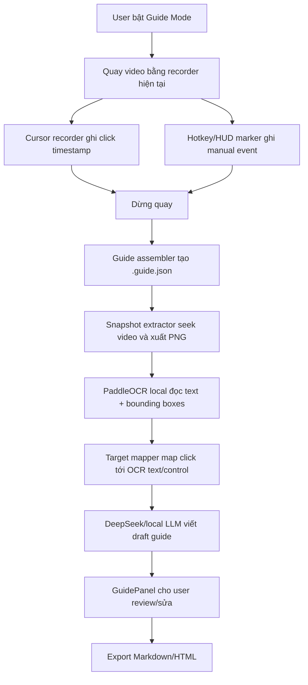

# Quy trình triển khai Auto User Guide Generation

Mục tiêu của tính năng này là biến OpenScreen từ công cụ quay màn hình thành công cụ tự tạo tài liệu hướng dẫn sử dụng phần mềm. Người dùng bật Guide Mode, quay thao tác như bình thường, hệ thống ghi lại thời điểm click hoặc hotkey, trích ảnh từ video sau khi quay xong, chạy OCR local để đọc chữ trên giao diện, sau đó dùng AI tạo bản nháp hướng dẫn từng bước.

Tài liệu này được viết để có thể bắt đầu coding ngay: có kiến trúc, schema, file cần thêm/sửa, thứ tự task, tiêu chí test và định nghĩa MVP.

## Trạng Thái MVP Hiện Tại

- Đã có Guide Mode trong HUD, ghi click/marker vào `.guide.json`.
- Đã có GuidePanel trong editor để chạy: prepare events, capture snapshots, OCR, generate draft, export Markdown/HTML.
- Đã có local deterministic draft để test không cần DeepSeek key.
- DeepSeek được gọi khi chọn provider `DeepSeek` và có `DEEPSEEK_API_KEY`.
- OCR local mặc định gọi `OPENSCREEN_GUIDE_OCR_URL` hoặc `http://127.0.0.1:8866/ocr`.
- Verification hiện tại: targeted guide tests pass, `npm test` pass, `npm run build-vite` pass, `npm run i18n:check` pass.

## Mục Tiêu Sản Phẩm

Flow người dùng:

1. Bật Guide Mode.
2. Quay màn hình phần mềm cần hướng dẫn.
3. Trong lúc quay, hệ thống tự ghi timestamp các click chuột.
4. Người dùng có thể bấm một hotkey/nút marker nếu muốn đánh dấu bước thủ công.
5. Sau khi dừng quay, hệ thống trích ảnh màn hình từ video tại các timestamp đó.
6. OCR local đọc text trên ảnh giao diện.
7. Hệ thống map vị trí click tới text/control gần nhất.
8. AI Agent tạo tài liệu dạng từng bước.
9. Người dùng review, sửa nội dung, export Markdown/HTML.

Ví dụ output:

```md
# Hướng dẫn xuất báo cáo

## Bước 1: Mở phần cài đặt

Nhấn nút **Settings** ở thanh điều hướng bên trái.

## Bước 2: Chọn Export

Trong màn hình Settings, chọn **Export report**.
```

## Phạm Vi MVP

MVP cần làm:

- Bật/tắt Guide Mode trước khi quay.
- Tận dụng recorder hiện tại, không viết recorder mới.
- Tận dụng `.cursor.json` hiện tại để lấy click timestamp.
- Thêm marker bằng hotkey hoặc nút trên HUD.
- Tạo sidecar `.guide.json` riêng cho guide.
- Trích screenshot sau khi quay xong, từ video đã lưu.
- OCR local bằng PaddleOCR service.
- Tạo step candidate từ click position + OCR blocks.
- Gọi DeepSeek bằng text metadata, không gửi ảnh mặc định.
- Có panel review trong editor.
- Export Markdown và HTML.

Không làm trong MVP:

- Không chụp screenshot realtime trong lúc quay nếu chưa có benchmark cần thiết.
- Không gửi raw screenshot lên cloud AI mặc định.
- Không sửa schema `.cursor.json` nếu không bắt buộc.
- Không build full UI automation engine.
- Không làm PDF/DOCX ngay.
- Không bundle OCR runtime vào app packaged ngay.

## Code Hiện Có Cần Tận Dụng

Các điểm đã có trong codebase:

- Recording orchestration: `src/hooks/useScreenRecorder.ts`
- Launch/HUD UI: `src/components/launch/LaunchWindow.tsx`
- Source selection: `src/components/launch/SourceSelector.tsx`
- Editor chính: `src/components/video-editor/VideoEditor.tsx`
- Project/session persistence: `src/components/video-editor/projectPersistence.ts`
- Cursor contracts: `src/native/contracts.ts`
- Hook đọc cursor data: `src/native/hooks/useCursorRecordingData.ts`
- IPC main handlers: `electron/ipc/handlers.ts`
- Native bridge: `electron/ipc/nativeBridge.ts`
- Cursor service: `electron/native-bridge/services/cursorService.ts`
- Windows cursor recording: `electron/native-bridge/cursor/recording/windowsNativeRecordingSession.ts`
- macOS cursor recording: `electron/native-bridge/cursor/recording/macNativeCursorRecordingSession.ts`
- Frame/export primitives: `src/lib/exporter/frameRenderer.ts`

Nhận định kỹ thuật:

- Windows/macOS native cursor recording đã có dữ liệu click.
- Cursor sample hiện có thể có `interactionType: "click" | "mouseup" | "move"`.
- Editor hiện đã dùng click timestamp để render hiệu ứng click.
- Vì schema cursor đang được nhiều nơi dùng, MVP nên tạo `.guide.json` riêng thay vì mở rộng `.cursor.json`.

## Kiến Trúc Tổng Thể



Quyết định chính:

- Realtime recording chỉ ghi event/timestamp, không xử lý OCR/AI.
- Screenshot được trích từ video sau khi quay, tránh ảnh hưởng performance recorder.
- OCR chạy local-first.
- DeepSeek chỉ nhận text metadata trừ khi user opt-in gửi ảnh.
- Guide data nằm cạnh recording artifact.

## File Cần Thêm

```text
src/guide/
  contracts.ts
  eventBuilder.ts
  targetMapper.ts
  promptBuilder.ts
  generatedGuideSchema.ts
  snapshot/
    extractGuideSnapshots.ts
  export/
    markdownExporter.ts
    htmlExporter.ts
  __tests__/
    eventBuilder.test.ts
    targetMapper.test.ts
    promptBuilder.test.ts
    markdownExporter.test.ts

src/components/video-editor/guide/
  GuidePanel.tsx
  GuideStepList.tsx
  GuideStepEditor.tsx
  GuideSnapshotPreview.tsx

electron/guide/
  guideStore.ts
  guidePaths.ts
  guideIpc.ts
  ocr/
    paddleOcrClient.ts
  ai/
    deepseekGuideClient.ts
```

File hiện có khả năng phải sửa:

- `src/hooks/useScreenRecorder.ts`
- `src/components/launch/LaunchWindow.tsx`
- `src/components/video-editor/VideoEditor.tsx`
- `electron/ipc/handlers.ts`
- `electron/preload.ts`
- file khai báo type cho `window.electronAPI`
- `package.json` nếu thêm script test hoặc dependency nhỏ

## Artifact Đầu Ra

Với video `recording-123.mp4`, hệ thống tạo:

```text
recording-123.mp4
recording-123.cursor.json
recording-123.guide.json
recording-123-guide/
  step-001.png
  step-002.png
  ocr.json
  guide.md
  guide.html
```

Quy tắc:

- `.cursor.json` vẫn là dữ liệu cursor gốc.
- `.guide.json` là source of truth cho guide workflow.
- Folder `recording-123-guide/` chứa file phát sinh từ guide.
- `guide.md` và `guide.html` có thể được tạo lại từ `.guide.json`.

## Contract Chính

Tạo `src/guide/contracts.ts`.

```ts
export type GuideEventKind = "click" | "hotkey" | "manual";

export type GuideEventSource =
  | "cursor-recording"
  | "guide-hotkey"
  | "review-ui";

export interface GuideEvent {
  id: string;
  recordingId: string;
  kind: GuideEventKind;
  source: GuideEventSource;
  timeMs: number;
  x?: number;
  y?: number;
  normalizedX?: number;
  normalizedY?: number;
  button?: "left" | "right" | "middle" | "unknown";
  label?: string;
  screenshotOffsetMs?: number;
  createdAt: string;
}

export interface GuideSnapshot {
  id: string;
  eventId: string;
  timeMs: number;
  offsetMs: number;
  path: string;
  width: number;
  height: number;
}

export interface OcrBlock {
  id: string;
  snapshotId: string;
  text: string;
  confidence: number;
  box: {
    x: number;
    y: number;
    width: number;
    height: number;
  };
}

export interface GuideStepCandidate {
  id: string;
  eventId: string;
  snapshotId?: string;
  timeMs: number;
  action: "click" | "choose" | "type" | "wait" | "manual";
  targetText?: string;
  targetRole?: "button" | "menu" | "tab" | "field" | "link" | "unknown";
  nearbyText: string[];
  confidence: number;
}

export interface GeneratedGuideStep {
  id: string;
  order: number;
  title: string;
  instruction: string;
  screenshotPath?: string;
  sourceCandidateId?: string;
}

export interface GeneratedGuide {
  title: string;
  summary?: string;
  steps: GeneratedGuideStep[];
}

export interface GuideSession {
  schemaVersion: 1;
  recordingId: string;
  videoPath: string;
  cursorPath?: string;
  guidePath: string;
  outputDir: string;
  status:
    | "recording"
    | "events-ready"
    | "snapshots-ready"
    | "ocr-ready"
    | "draft-ready"
    | "reviewed";
  events: GuideEvent[];
  snapshots: GuideSnapshot[];
  ocrBlocks: OcrBlock[];
  candidates: GuideStepCandidate[];
  generatedGuide?: GeneratedGuide;
  createdAt: string;
  updatedAt: string;
}
```

Quy tắc dữ liệu:

- `timeMs` luôn tính theo timeline video cuối cùng.
- `x/y` là tọa độ pixel nếu có.
- `normalizedX/Y` dùng để chống lệch khi video scale.
- `screenshotOffsetMs` mặc định `500`, nghĩa là lấy ảnh sau click 0.5 giây để bắt trạng thái UI sau thao tác.
- AI output chỉ là draft, user edit mới là nội dung cuối.

## IPC Cần Thêm

MVP dùng app-level Electron IPC, không cần đưa vào native bridge vì đây là workflow cấp ứng dụng.

Preload API đề xuất:

```ts
window.electronAPI.guide = {
  startSession(recordingId: string): Promise<GuideSession>;
  addMarker(input: AddGuideMarkerInput): Promise<GuideEvent>;
  finalizeEvents(input: FinalizeGuideEventsInput): Promise<GuideSession>;
  writeSnapshot(input: WriteGuideSnapshotInput): Promise<GuideSnapshot>;
  runOcr(input: RunGuideOcrInput): Promise<GuideSession>;
  generateDraft(input: GenerateGuideDraftInput): Promise<GuideSession>;
  saveGuide(input: SaveGuideInput): Promise<GuideSession>;
  exportMarkdown(input: ExportGuideInput): Promise<{ path: string }>;
  exportHtml(input: ExportGuideInput): Promise<{ path: string }>;
};
```

Input types:

```ts
export interface AddGuideMarkerInput {
  recordingId: string;
  timeMs: number;
  kind: "hotkey" | "manual";
  label?: string;
}

export interface FinalizeGuideEventsInput {
  recordingId: string;
  videoPath: string;
  cursorPath?: string;
}

export interface WriteGuideSnapshotInput {
  recordingId: string;
  eventId: string;
  timeMs: number;
  offsetMs: number;
  pngBytes: ArrayBuffer;
  width: number;
  height: number;
}

export interface RunGuideOcrInput {
  recordingId: string;
  snapshotIds?: string[];
}

export interface GenerateGuideDraftInput {
  recordingId: string;
  language: "vi" | "en";
  provider: "deepseek" | "local";
}

export interface SaveGuideInput {
  recordingId: string;
  generatedGuide: GeneratedGuide;
}

export interface ExportGuideInput {
  recordingId: string;
}
```

## Phase 1: Contracts, Store, IPC

Mục tiêu: tạo khung lưu trữ `.guide.json` mà chưa đụng recorder.

Task coding:

1. Tạo `src/guide/contracts.ts`.
2. Tạo `electron/guide/guidePaths.ts`.
3. Tạo `electron/guide/guideStore.ts`.
4. Tạo `electron/guide/guideIpc.ts`.
5. Register guide IPC trong `electron/ipc/handlers.ts`.
6. Expose API trong `electron/preload.ts`.
7. Bổ sung type cho `window.electronAPI.guide`.

Yêu cầu kỹ thuật:

- Ghi file atomically: write temp file rồi rename.
- Validate `schemaVersion`.
- Không throw raw error ra renderer, trả error code ổn định.
- Không yêu cầu AI/OCR trong phase này.

Acceptance:

- Tạo được guide session fake bằng IPC.
- Đọc/ghi `.guide.json` round-trip không mất dữ liệu.
- Input thiếu `recordingId` hoặc `videoPath` bị reject rõ ràng.

Test:

- `guideStore` tạo path đúng.
- `guideStore` đọc file lỗi schema và trả error.
- IPC handler reject input thiếu field.

## Phase 2: Build Event Từ Cursor Click

Mục tiêu: lấy click event từ `.cursor.json` hiện tại.

Task coding:

1. Tạo `src/guide/eventBuilder.ts`.
2. Thêm hàm `buildGuideEventsFromCursor`.
3. Lọc sample có `interactionType === "click"`.
4. Convert sang `GuideEvent`.
5. De-duplicate click trong cửa sổ `250ms`.
6. Sort theo `timeMs`.
7. Merge với marker thủ công nếu có.

Pseudo-code:

```ts
export function buildGuideEventsFromCursor(input: {
  recordingId: string;
  samples: CursorRecordingSample[];
  videoWidth?: number;
  videoHeight?: number;
}): GuideEvent[] {
  const events = input.samples
    .filter((sample) => sample.interactionType === "click")
    .map((sample) => ({
      id: createGuideEventId(input.recordingId, sample.timeMs),
      recordingId: input.recordingId,
      kind: "click" as const,
      source: "cursor-recording" as const,
      timeMs: sample.timeMs,
      x: sample.cx,
      y: sample.cy,
      normalizedX: normalize(sample.cx, input.videoWidth),
      normalizedY: normalize(sample.cy, input.videoHeight),
      button: "left" as const,
      screenshotOffsetMs: 500,
      createdAt: new Date().toISOString(),
    }));

  return sortGuideEvents(dedupeGuideEvents(events));
}
```

Acceptance:

- 5 click samples tạo 5 guide events.
- `move` và `mouseup` không tạo step.
- Double click hoặc click bounce không tạo quá nhiều step nếu nằm trong dedupe window.
- Không có cursor click thì vẫn dùng được manual marker.

Test:

- convert click sample.
- bỏ qua move/mouseup.
- dedupe theo thời gian.
- sort đúng thứ tự.
- xử lý sample thiếu tọa độ.

## Phase 3: Guide Mode UI Và Manual Marker

Mục tiêu: user bật được Guide Mode và đánh dấu bước thủ công.

Task coding:

1. Thêm Guide Mode toggle trong `LaunchWindow.tsx`.
2. Truyền trạng thái guide vào flow recording trong `useScreenRecorder.ts`.
3. Khi start recording và Guide Mode on, gọi `guide.startSession(recordingId)`.
4. Thêm nút marker trong HUD.
5. Thêm global hotkey ở Electron main, ví dụ `CommandOrControl+Shift+G`.
6. Khi bấm marker/hotkey, gọi `guide.addMarker`.
7. Khi stop recording, gọi `guide.finalizeEvents`.

Lưu ý:

- Global hotkey phải nằm ở Electron main vì app đang được quay có thể đang focus.
- Nếu register hotkey fail, UI vẫn dùng nút marker.
- Không làm thay đổi behavior khi Guide Mode off.

Acceptance:

- Guide Mode off: quay/sửa/export vẫn như cũ.
- Guide Mode on: stop recording tạo `.guide.json`.
- Hotkey tạo event đúng timestamp.
- Cancel recording không để lại guide artifact rác.

## Phase 4: Snapshot Extraction

Mục tiêu: trích ảnh PNG cho từng event sau khi quay xong.

Quyết định MVP:

- Không chụp realtime trong lúc quay.
- Dùng video đã lưu, seek tới timestamp cần lấy.
- Thực hiện trong renderer/editor bằng hidden `<video>` + `<canvas>`.
- Persist PNG qua IPC.

Task coding:

1. Tạo `src/guide/snapshot/extractGuideSnapshots.ts`.
2. Nhận `GuideSession` + `videoPath`.
3. Với mỗi event, lấy timestamp `event.timeMs + screenshotOffsetMs`.
4. Clamp timestamp vào duration video.
5. Seek hidden video tới timestamp.
6. Draw frame vào canvas.
7. Convert canvas thành PNG bytes.
8. Gọi `guide.writeSnapshot`.
9. Update `.guide.json` với danh sách snapshots.

Acceptance:

- Mỗi event có một ảnh `step-xxx.png`.
- Nếu một event fail snapshot, các event khác vẫn chạy.
- Ảnh được lưu trong `recording-123-guide/`.
- UI báo lỗi recoverable, không crash editor.

Test:

- clamp timestamp.
- tên file đúng thứ tự.
- handle seek timeout.
- không abort toàn bộ batch khi một frame lỗi.

## Phase 5: OCR Local

Mục tiêu: đọc text trên giao diện phần mềm từ screenshot.

Khuyến nghị:

- Dùng PaddleOCR làm OCR chính.
- Tesseract chỉ nên là fallback đơn giản.
- VLM local như Gemma 3 4B/MiniCPM/Qwen-VL chỉ dùng cho trường hợp icon/no-text khó, không dùng làm OCR chính.

Kiến trúc MVP:

- Chạy PaddleOCR như local HTTP service tại `127.0.0.1:8866`.
- Electron main gọi OCR service.
- Renderer không gọi OCR trực tiếp.

API local OCR đề xuất:

```http
GET /health
POST /ocr
Content-Type: application/json

{
  "imagePath": "D:\\Code\\OpenScreen\\recording-123-guide\\step-001.png",
  "language": "vi,en"
}
```

Response:

```json
{
  "blocks": [
    {
      "text": "Settings",
      "confidence": 0.97,
      "box": { "x": 120, "y": 80, "width": 90, "height": 24 }
    }
  ]
}
```

Task coding:

1. Tạo `electron/guide/ocr/paddleOcrClient.ts`.
2. Thêm health check.
3. Gọi OCR cho từng snapshot.
4. Convert output sang `OcrBlock`.
5. Ghi `ocrBlocks` vào `.guide.json`.
6. Ghi bản tổng hợp vào `recording-123-guide/ocr.json`.

Config đề xuất:

```ts
export interface GuideOcrConfig {
  provider: "paddleocr";
  baseUrl: string; // default http://127.0.0.1:8866
  language: string; // default vi,en
  timeoutMs: number; // default 30000
}
```

Acceptance:

- OCR service offline thì UI báo lỗi rõ ràng.
- OCR fail không xóa snapshots.
- OCR result có text, confidence, bounding box.
- Guide vẫn export thủ công được nếu OCR không chạy.

## Phase 6: Target Mapper

Mục tiêu: xác định user đã click vào nút/menu/field nào dựa trên tọa độ click và OCR.

Task coding:

1. Tạo `src/guide/targetMapper.ts`.
2. Với mỗi `GuideEvent`, lấy snapshot tương ứng.
3. Lấy OCR blocks của snapshot đó.
4. Score từng OCR block.
5. Chọn target tốt nhất.
6. Sinh `GuideStepCandidate`.

Scoring đề xuất:

- `+100` nếu click nằm trong OCR box.
- Điểm cao hơn nếu box center gần click hơn.
- Cộng điểm nếu text ngắn, giống label button/menu.
- Trừ điểm nếu confidence thấp.
- Nếu không có block đủ tốt, để `targetRole: "unknown"`.

Role heuristic:

- `button`: click vào/near text dạng action label.
- `menu`: text nằm trong danh sách dọc.
- `tab`: text nằm trong hàng ngang gần đầu giao diện.
- `field`: click vào vùng giống input.
- `unknown`: không đủ tự tin.

Acceptance:

- Click trực tiếp vào nút text map đúng target text.
- Click gần label map được OCR block gần nhất.
- Click vùng icon/no-text tạo candidate confidence thấp để user review.

Test:

- click inside box.
- nearest box.
- low-confidence penalty.
- no OCR fallback.

## Phase 7: AI Draft Generation

Mục tiêu: tạo bản nháp hướng dẫn từ candidate metadata.

Provider MVP:

- DeepSeek API cho cloud text generation.
- Local LLM có thể thêm sau qua cùng prompt contract.
- Không gửi ảnh lên DeepSeek mặc định.

Task coding:

1. Tạo `src/guide/promptBuilder.ts`.
2. Tạo `electron/guide/ai/deepseekGuideClient.ts`.
3. Đọc API key ở Electron main qua env/config.
4. Build prompt từ candidates + OCR nearby text.
5. Yêu cầu output JSON.
6. Validate output.
7. Ghi `generatedGuide` vào `.guide.json`.

Env:

```powershell
$env:DEEPSEEK_API_KEY="..."
$env:DEEPSEEK_BASE_URL="https://api.deepseek.com"
$env:DEEPSEEK_MODEL="deepseek-v4-flash"
```

Prompt input:

```json
{
  "language": "vi",
  "softwareContext": {
    "recordingName": "recording-123",
    "userGoal": "Tạo báo cáo"
  },
  "steps": [
    {
      "order": 1,
      "eventKind": "click",
      "targetText": "Settings",
      "targetRole": "button",
      "nearbyText": ["Home", "Settings", "Account"],
      "confidence": 0.91
    }
  ]
}
```

Expected AI output:

```json
{
  "title": "Hướng dẫn thao tác",
  "summary": "Tài liệu này mô tả các bước thực hiện thao tác đã ghi hình.",
  "steps": [
    {
      "order": 1,
      "title": "Mở phần cài đặt",
      "instruction": "Nhấn nút Settings ở thanh điều hướng bên trái."
    }
  ]
}
```

Acceptance:

- Thiếu API key thì UI báo lỗi rõ ràng.
- AI trả invalid JSON thì reject và cho retry.
- Output được validate trước khi lưu.
- Có thể generate tiếng Việt.

Test:

- promptBuilder không đưa raw image vào prompt.
- parser reject JSON sai schema.
- DeepSeek client handle timeout/401/rate limit.

## Phase 8: GuidePanel Review UI

Mục tiêu: người dùng sửa được guide trước khi export.

Task coding:

1. Tạo `src/components/video-editor/guide/GuidePanel.tsx`.
2. Tạo `GuideStepList.tsx`.
3. Tạo `GuideStepEditor.tsx`.
4. Tạo `GuideSnapshotPreview.tsx`.
5. Mount panel trong `VideoEditor.tsx`.
6. Load `.guide.json` khi mở video có guide sidecar.
7. Thêm action:
   - Generate snapshots.
   - Run OCR.
   - Generate AI draft.
   - Save edits.
   - Export Markdown.
   - Export HTML.

UX:

- AI output là draft, không khóa nội dung.
- User sửa title/instruction từng step.
- User xóa step nhiễu.
- User merge step sau nếu cần.
- Confidence hiển thị nhỏ, không làm UI rối.
- Guide fail không ảnh hưởng video editing.

Acceptance:

- User sửa step và save được.
- User xóa step được.
- Regenerate cần confirm nếu đang có manual edits.
- Export dùng nội dung đã sửa, không dùng lại AI raw output.

## Phase 9: Export Markdown/HTML

Mục tiêu: tạo tài liệu dùng được ngay.

Task coding:

1. Tạo `src/guide/export/markdownExporter.ts`.
2. Tạo `src/guide/export/htmlExporter.ts`.
3. Gọi exporter từ Electron IPC.
4. Ghi file vào `recording-123-guide/guide.md`.
5. Ghi file vào `recording-123-guide/guide.html`.
6. Dùng relative screenshot link.

Markdown format:

```md
# Hướng dẫn thao tác

Tài liệu này mô tả các bước thực hiện thao tác đã ghi hình.

## Bước 1: Mở phần cài đặt

Nhấn nút **Settings** ở thanh điều hướng bên trái.


```

Acceptance:

- Markdown mở được và thấy ảnh local.
- HTML mở được bằng browser.
- Export vẫn chạy nếu guide được viết thủ công, không cần AI.

## Thứ Tự Coding Ngay

Nên làm theo thứ tự này để giảm rủi ro:

1. Tạo `src/guide/contracts.ts`.
2. Tạo `electron/guide/guidePaths.ts`.
3. Tạo `electron/guide/guideStore.ts`.
4. Tạo `electron/guide/guideIpc.ts`.
5. Expose `window.electronAPI.guide`.
6. Viết unit test cho guide store.
7. Tạo `src/guide/eventBuilder.ts`.
8. Viết unit test convert cursor samples sang guide events.
9. Thêm Guide Mode toggle vào launch UI.
10. Gọi `startSession` khi bắt đầu quay.
11. Gọi `finalizeEvents` khi dừng quay.
12. Tạo snapshot extractor trong renderer.
13. Tạo `paddleOcrClient`.
14. Tạo `targetMapper`.
15. Tạo `promptBuilder`.
16. Tạo `deepseekGuideClient`.
17. Tạo `GuidePanel`.
18. Tạo Markdown/HTML exporters.
19. Chạy lint/test/build.
20. Test thủ công flow đầy đủ.

Chia PR đề xuất:

- PR 1: contracts, store, IPC, unit tests.
- PR 2: cursor-click event builder, Guide Mode toggle, manual marker.
- PR 3: snapshot extraction và GuidePanel shell.
- PR 4: PaddleOCR integration và target mapping.
- PR 5: DeepSeek generation, review UI, Markdown/HTML export.

## Error Codes

Dùng error code ổn định để UI xử lý:

```ts
export type GuideErrorCode =
  | "guide-session-not-found"
  | "guide-invalid-schema"
  | "guide-video-load-failed"
  | "guide-snapshot-failed"
  | "guide-ocr-unavailable"
  | "guide-ocr-failed"
  | "guide-ai-key-missing"
  | "guide-ai-request-failed"
  | "guide-ai-invalid-output"
  | "guide-export-failed";
```

Quy tắc:

- IPC không throw raw provider error ra renderer.
- OCR fail là recoverable.
- AI fail là recoverable.
- Export fail phải giữ nguyên `.guide.json`.

## Local Development

Baseline:

```powershell
npm install
npm run lint
npm test
npm run build-vite
```

OCR service dev:

```powershell
python -m venv .venv-ocr
.venv-ocr\Scripts\Activate.ps1
pip install paddleocr fastapi uvicorn
uvicorn local_ocr_service:app --host 127.0.0.1 --port 8866
```

DeepSeek env:

```powershell
$env:DEEPSEEK_API_KEY="..."
$env:DEEPSEEK_BASE_URL="https://api.deepseek.com"
$env:DEEPSEEK_MODEL="deepseek-v4-flash"
```

Không commit API key.

## Testing Matrix

Unit tests:

- `eventBuilder`: cursor sample -> guide events.
- `targetMapper`: OCR blocks -> step candidates.
- `promptBuilder`: candidates -> AI prompt.
- `markdownExporter`: generated guide -> Markdown.
- `htmlExporter`: generated guide -> HTML.

Renderer/browser tests:

- snapshot extractor seek video fixture.
- GuidePanel edit/delete/save step.

Manual integration:

1. Quay với Guide Mode off, xác nhận behavior cũ không đổi.
2. Quay với Guide Mode on và 3 click.
3. Kiểm tra `.guide.json` có 3 click events.
4. Generate snapshots.
5. Run OCR local.
6. Generate Vietnamese draft.
7. Sửa một step.
8. Export Markdown.
9. Mở Markdown/HTML xem ảnh local.
10. Tắt OCR service và test lỗi recoverable.
11. Xóa DeepSeek key và test lỗi recoverable.

Lệnh trước khi merge:

```powershell
npm run lint
npm test
npm run build-vite
```

Nếu phase không sửa native recorder thì chưa cần chạy native helper tests.

## Definition Of Done Cho MVP

MVP được xem là xong khi:

- Guide Mode bật/tắt được.
- Guide Mode off không ảnh hưởng recording hiện tại.
- Click events lấy được từ cursor telemetry hiện có.
- Hotkey/HUD marker tạo event thủ công.
- `.guide.json` được tạo cạnh recording.
- Snapshot PNG được trích từ final video.
- PaddleOCR local đọc được text và bounding boxes.
- Target mapper tạo step candidates.
- DeepSeek tạo được draft tiếng Việt từ text metadata.
- User review/sửa/xóa step được.
- Export Markdown/HTML dùng nội dung đã review.
- Lint/test/build pass.

## Nâng Cấp Sau MVP

- Export PDF/DOCX.
- Bundle local OCR runtime vào packaged app.
- Thêm local VLM fallback cho icon-only control.
- Cho phép user opt-in gửi crop ảnh lên remote vision model.
- Merge/dedupe step thông minh hơn cho double click/menu navigation.
- Dùng transcript giọng nói làm ngữ cảnh thêm.
- Template theo từng loại phần mềm.
- Computer vision detect UI element ngoài OCR.
